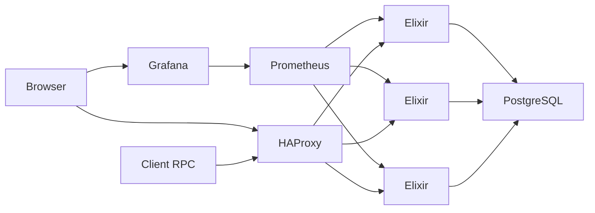

### Sports App
---
Elixir application that serves every information extracted from `data.csv`, which contains information about football matches (league, season, away team, home team, and its scores). 

This application uses REST API and Protocol Buffers to list the result matches.

### Requirements:
- Docker;
- Git;

### Architecture:
- Elixir 1.8
    - Cowboy (HTTP Server);
    - gRPC (gRPC Server);
    - Plug Cowboy (Create HTTP pipelines);
    - Ecto (Access database);
    - Postgrex (Driver to access PostgreSQL Database);
    - Poison (Library to work with JSON);
- PostgreSQL;
- HAProxy 2.0 (Load balancer, reverse-proxy);
- Prometheus (System monitoring);
- Grafana (Metrics visualization);

#### Clusterized architecture:


#### Folder organization:
<details>
    <summary>
.
    </summary>
    
    ├── config.................# Configuration environments
    ├── docker.................# Docker-compose files
    │   └── config.............# Configurations files for Containers          
    ├── lib
    │   ├── app................# Application first's steps
    │   ├── handlers...........# Handle requests obeying business rules
    │   ├── metrics............# Initialize and create metrics
    │   ├── models.............# DTOs to access database
    │   ├── proto..............# Protobuffer definitions
    │   └── routers............# Serves resources determined by routes/protocols
    ├── priv
    │   └── repo...............# Seeds/Migration files
    ├── resources..............# App's resources
    └── test...................# Test's folder
    
</details>

---

### How to run tests:
1. Build Docker image

```shell
$ docker-compose build
```

2. Run migrations and seeds
```shell
$ docker-compose run -e MIX_ENV=test api mix do ecto.create, ecto.migrate, run priv/repo/seeds.exs
```

2. Run unit tests
```shell
$ docker-compose run -e MIX_ENV=test api mix test
```

### How to run:
<details>
    <summary>
Docker Swarm (Clusterized)
    </summary>
1. Build Docker image

```shell
$ docker build -f docker/Dockerfile -t sports-app --no-cache .
```

2. Initialize cluster (applying migration and seeds) and wait to finish
```shell
$ ./docker/initialize_cluster.sh --with-migration-and-seeds
```
*PS: There are some conditions races when you are executing this command for the first time, if it doesn't go well, try again.*

3. See `docker service` status
```shell
$ docker service ls
```
</details>

<details>
    <summary>
Docker Compose
    </summary>
1. Build Docker image

```shell
$ docker-compose build
```

2. Start the database and wait to be ready
```shell
$ docker-compose up -d database
```

2. Run migrations and seeds
```shell
$ docker-compose run api mix do ecto.create, ecto.migrate, run priv/repo/seeds.exs
```

3. Start application
```shell
$ docker-compose up
```
</details>

---

### How to use (REST):

<details>
<summary>
GET /ping
</summary>

> REST API Resource to use as Health Check

```shell
curl --location --request GET "localhost/ping"
```
```json
HTTP Status Code: 200
{
  "response": "ok"
}
```
</details>

<details>

<summary>
GET /matches
</summary>

> REST API Resource to retrieve information about the matches. You need to pass at least one of these parameters (league or season), otherwise, this API will return a Bad Request.

```shell
curl --location --request GET "localhost/matches?league=La%20Liga&season=201617"
```
```json
HTTP Status: 200
Query Parameters: ?league=La Liga&season=201617
{
    "matches": [
        {
            "season": "201617",
            "league": "La Liga",
            "id": 1,
            "htr": "D",
            "hthg": 0,
            "htag": 0,
            "home_team": "La Coruna",
            "ftr": "H",
            "fthg": 2,
            "ftag": 1,
            "date": "19/08/2016",
            "away_team": "Eibar"
        },
        {
            "season": "201617",
            "league": "La Liga",
            "id": 2,
            "htr": "D",
            "hthg": 0,
            "htag": 0,
            "home_team": "Malaga",
            "ftr": "D",
            "fthg": 1,
            "ftag": 1,
            "date": "19/08/2016",
            "away_team": "Osasuna"
        },
        ...
    ]
}
```

```shell
curl --location --request GET "localhost/matches?league=Unknown%20League"
```
```json
HTTP Status Code: 404
Query Parameters: ?league=Unknown League
{
    "matches": []
}
```

```shell
curl --location --request GET "localhost/matches?unknow_field=Unknown%20League"
```
```json
HTTP Status Code: 400
Query Parameters: <none>
{
    "response": "bad request, missing fields",
    "fields": [
        "league",
        "season"
    ]
}
```
</details>

### Protocol Buffer Definition:
To do a request using Protocol Buffers as `gRPC`, you need to compile with this data structure below, point to port `8000` and make a request.

The protocol buffer definition is written below:

```proto3
syntax = "proto3";

package sports_app;

service MatchesService {
  rpc SearchMatches (MatchesParameters) returns (MatchesResponse) {}
}

message MatchesParameters {
    string league = 1;
    string season = 2;
}

message MatchesResponse {
  repeated Match matches = 1;
}

message Match {
    string league = 1;
    string season = 2;
    string date = 3;
    string home_team = 4;
    string away_team = 5;
    int32 fthg = 6;
    int32 ftag = 7;
    string ftr = 8;
    int32 hthg = 9;
    int32 htag = 10;
    string htr = 11;
}
```

---

### Metrics and Data Visualization:

It is possible to visualize from `Grafana` the information that `Prometheus` collected from all `Elixir nodes`, you have to access the following link below and use the login and password as `admin`:

| Grafana               | Prometheus            |
| --------------------- | --------------------- |
| http://localhost:3000 | http://localhost:9090 |

---
